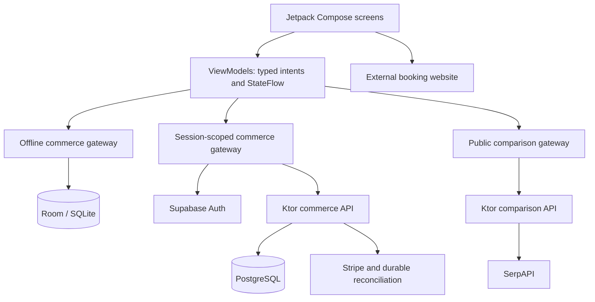

# Roam — your world, connected.

[](https://github.com/jon-jc/roam-android/actions/workflows/android.yml)
[](https://github.com/jon-jc/roam-android/actions/workflows/server.yml)


[](LICENSE)

**A native Android travel app for comparing accommodation prices, building a travel passport, and managing bookings and credits.** Roam pairs a polished Jetpack Compose interface with a Kotlin backend that handles the difficult parts of commerce: exact money, concurrent inventory, account isolation, and recovery when a payment response goes missing.

The repository contains a complete offline demo, an independent accommodation-search integration, and a connected account and payment service. It is designed to make the product easy to try and its engineering easy to inspect.

<p align="center">
  
  
  
</p>

**[Download the demo APK](https://github.com/jon-jc/roam-android/releases/latest)** · **[Architecture](docs/architecture.md)** · **[Test evidence](docs/verification.md)** · **[Five-minute walkthrough](docs/walkthrough.md)**

> **Current status — v2.1.0:** the offline experience is runnable without accounts or keys. Connected services and the SerpAPI comparison adapter are implemented and tested with controlled provider responses. No backend is hosted by this repository, and real provider acceptance awaits your accounts and credentials. The downloadable APK is a development-signed, optimized demo; it does not provide live prices out of the box.

## Contents

- [What you can do](#what-you-can-do)
- [Try the demo](#try-the-demo)
- [Build from source](#build-from-source)
- [Choose a build variant](#choose-a-build-variant)
- [Connect accommodation search](#connect-accommodation-search)
- [Connect accounts and payments](#connect-accounts-and-payments)
- [Configuration and secrets](#configuration-and-secrets)
- [Architecture and engineering decisions](#architecture-and-engineering-decisions)
- [Tests, CI, and performance](#tests-ci-and-performance)
- [Troubleshooting](#troubleshooting)
- [Launch readiness and next steps](#launch-readiness-and-next-steps)
- [Documentation and source map](#documentation-and-source-map)
- [Contributing and licensing](#contributing-and-licensing)

## What you can do

| Experience | What is implemented |
| --- | --- |
| Accommodation comparison | Search hotels and vacation rentals for the same trip; inspect booking-site offers, price freshness, and source coverage; continue to an external provider to book. Available before sign-in. |
| Discovery and saved stays | Explore a curated catalog, combine destination/category/saved filters, and keep a persistent wish list in the demo. |
| Trip planning | Select dates and occupancy, review a price breakdown, and see the original credit and card allocation before confirming. |
| Travel wallet | Follow a durable credit ledger. The demo starts with $85 and offers a one-time $25 welcome benefit; new connected accounts start at zero. |
| Recoverable checkout | Retry an interrupted request without creating another reservation or spending credit twice. Connected payments use native Stripe PaymentSheet and authoritative server status. |
| Booking history | Preserve original prices and stay details; cancel eligible reservations before check-in and return only the original credits after reconciliation. |
| Travel passport | Edit a profile and control its public preview. Profile information is self-reported, not verified identity. |
| Portable demo receipts | Share versioned, privacy-minimized JSON through Android's share sheet. Unresolved and connected transactions are excluded from this demo receipt format. |
| Adaptive native UI | Dark mode, larger text support, semantic controls, adaptive grids, and a navigation rail on wide windows. |

The offline stays in Japan, Italy, and Portugal, the demo account, credits, and card payments are fictional. External comparison offers are a separate product boundary: they never become Roam inventory, wallet transactions, or Stripe charges.

## Try the demo

1. Open the [latest release](https://github.com/jon-jc/roam-android/releases/latest) and download `Roam-2.1.0-demo.apk` to an Android 8.0+ device or emulator. The release also includes source, a service distribution, and checksums.
2. Install and launch Roam. No sign-in, backend, or API key is needed for the offline journey. Photos and fonts are bundled.
3. Search for Japan, save Kyoto, and try the saved filter. Open **Wallet** and claim the welcome benefit.
4. Choose a stay and dates, proceed to checkout, then choose **Demo controls → Response interrupted**. Confirm and select **Recover my reservation** to see a single booking and credit debit despite the lost response.
5. Cancel before check-in, inspect the returned credits, and export the historical receipt. Try dark mode and a wider device.

The **Compare** entry demonstrates the search interface. Until a comparison service is configured, it explicitly reports that search is not connected and shows no invented prices. See the [walkthrough](docs/walkthrough.md) for code pointers and discussion prompts.

## Build from source

### Requirements

| Tool | Version / purpose |
| --- | --- |
| JDK | 17; configure both `JAVA_HOME` and Android Studio's Gradle JDK |
| Android SDK | Platform 36, build tools 35.0.0, and platform tools |
| Device | Android 8.0 / API 26 or newer; CI runs native tests on API 35 |
| Gradle | Included 8.13 wrapper; no global Gradle installation needed |
| Docker | Needed for PostgreSQL integration tests and optional service containers; not for the offline app |
| Python | Needed only for the receipt-schema and release-configuration verification scripts |

The project uses Kotlin 2.2.20 and Android Gradle Plugin 8.13.0. Dependencies download on the first build; the installed demo journey then works offline.

```sh
git clone https://github.com/jon-jc/roam-android.git
cd roam-android
./gradlew :app:assembleDebug
adb install -r app/build/outputs/apk/debug/app-debug.apk
```

On Windows, use `.\gradlew.bat` in place of `./gradlew`. Open the repository root in Android Studio, sync Gradle, select the `debug` build variant for `app`, and run. Android Studio creates the ignored `local.properties`; command-line builds can use `ANDROID_HOME` to locate the SDK.

No `roam.properties` file is needed for the default offline build. To reset the demo, clear Roam's app storage; this removes its local bookings, profile edits, wish list, and ledger.

## Choose a build variant

| Variant | Behavior | Required configuration | Installation / signing |
| --- | --- | --- | --- |
| `debug` | Offline demo with a Compare entry | None for demo; optional comparison service URL | `com.roam.app`; debug signed |
| `benchmark` | Minified, profileable offline demo used for measurement and the downloadable APK | None for demo | `com.roam.app`; development signed |
| `staging` | Connected development build; opens Compare before sign-in | Search URL for comparison; account/payment settings for commerce | `com.roam.app.staging`; debug signed; permits selected local HTTP hosts |
| `comparison` | Independent search-only release; no account or payment screens | Public HTTPS `ROAM_COMPARISON_API_URL` | `com.roam.app.compare`; minified and unsigned |
| `release` | Connected commerce release with comparison | Public HTTPS services, Supabase publishable key, Stripe live publishable key | `com.roam.app`; minified and unsigned |

Build with `:app:assembleDebug`, `:app:assembleBenchmark`, `:app:assembleStaging`, `:app:assembleComparison`, or `:app:assembleRelease`. APKs appear under `app/build/outputs/apk/<variant>/`. Release and comparison artifacts require your protected signing pipeline before installation or distribution. Use staging for Stripe test mode.

Debug, benchmark, and release share an application ID. Different signing certificates can prevent installing one over another; uninstalling the old app also deletes its local data. Staging and comparison have separate IDs.

## Connect accommodation search

**Start with SerpAPI.** Its Google Hotels adapter is implemented for hotel search, vacation-rental search, and property-level booking-site offers. The [API selection and setup guide](docs/accommodation-apis.md) explains signup, provider tradeoffs, limits, and acceptance checks. LiteAPI, Expedia Rapid, and Booking.com Demand are future integration options, not additional connected sources in this version.

Airbnb is a separate link to its consumer website. Roam does **not** fetch Airbnb prices or claim to have searched Airbnb inventory. Enter or confirm your dates and guests on that site.

### Run the independent search service

This mode requires no PostgreSQL, Supabase, or Stripe configuration. From the repository root:

```sh
./gradlew :server:installDist
ROAM_ENV=development server/build/install/server/bin/server --comparison-only
```

In PowerShell:

```powershell
.\gradlew.bat :server:installDist
$env:ROAM_ENV = 'development'
.\server\build\install\server\bin\server.bat --comparison-only
```

The launcher reads environment variables; it does not automatically load `.env`. Without a provider key, the service starts successfully and returns explicit `NOT_CONFIGURED` coverage with no prices. To enable actual searches, supply `SERPAPI_API_KEY` through the server environment or secret manager. Never embed it in Android.

Create the ignored root `roam.properties` with:

```properties
ROAM_COMPARISON_API_URL=http://10.0.2.2:8080
```

In another terminal, build and install staging:

```sh
./gradlew :app:assembleStaging
adb install -r app/build/outputs/apk/staging/app-staging.apk
```

`10.0.2.2` reaches the host from an Android emulator. Use a public HTTPS endpoint for a hosted service or physical device. For the independent release, change the URL to your public HTTPS service and run `:app:assembleComparison`; no account or payment keys are required. Container setup is in the [comparison guide](docs/accommodation-apis.md#put-the-key-on-the-server).

### What a comparison price means

- The submitted destination, dates, guest counts, child ages, market, and currency remain consistent across hotel and rental searches.
- Prices are fresh search observations, not guaranteed checkout prices or inventory holds. Search and details expire after five minutes; the app rechecks freshness before opening a priced offer.
- Only reported, tax-inclusive full-stay totals in the requested currency qualify for comparable-total ordering. Missing totals and unknown fees stay visible; Roam never multiplies a nightly rate to invent a total or performs implicit currency conversion.
- Room types, meals, and cancellation terms can differ. A lower observed price does not prove an equivalent offer or the lowest rate on the internet.
- Source errors, timeouts, exhausted quotas, missing configuration, and successful empty results have distinct states. One failed source does not hide successful results from another.
- This adapter supports one room, 1–6 adults, up to four children aged 1–17, and 1–28 nights, with check-in within 365 days. Supported currencies are USD, EUR, GBP, CAD, AUD, and JPY; market choices are US, UK, Canada, Australia, Germany, France, and Japan. Results are bounded to 50 properties per category and 60 offers per property, without pagination.

Searching both accommodation categories normally consumes two upstream calls; opening property offers consumes another. Fresh searches request `no_cache=true`, and there are no automatic paid retries. The default 200-call daily budget is **per process**, resets on restart, and multiplies across replicas. Public deployment needs shared ingress limits and provider account spending controls. See the [coverage rules](docs/accommodation-apis.md#price-and-coverage-rules) and [provider acceptance checklist](docs/accommodation-apis.md#verify-after-signing-up).

## Connect accounts and payments

The connected path uses **Supabase email OTP**, a **Ktor service with PostgreSQL**, and **Stripe PaymentSheet**. Configure it with the [connected setup guide](docs/connected-setup.md) and [service runbook](server/README.md).

1. Configure Supabase email delivery and a code-based email template. Roam accepts a typed email code; it does not implement the default magic-link callback. Use asymmetric ES256 or RS256 JWT signing.
2. Configure a private PostgreSQL schema and verified database TLS. Only the backend receives database credentials.
3. Configure Stripe test keys and the service's signed webhook endpoint. Supply only publishable configuration to Android using [roam.properties.example](roam.properties.example). Set its optional comparison URL to your search service, or remove that entry to inherit `ROAM_API_URL`; the copied emulator URL otherwise keeps overriding it.
4. Build the service and staging app with `./gradlew :server:installDist :app:assembleStaging`. Follow the runbook to start the service directly or in its hardened container, then install the staging APK.
5. Verify actual email delivery, sign-in, quote creation, payment challenges, interrupted responses, cancellation, refunds, and webhooks in your environment before considering live mode.

Missing configuration displays an unavailable state; it never creates a simulated connected account or successful payment. New connected accounts start with zero credit. No catalog is automatically sold: explicit development seeding creates fictional inventory, and live Stripe mode refuses to sell it. Production requires inventory you are authorized to offer.

The commerce service currently supports single-unit stays priced in USD, an 8% service fee rounded half up, five-minute quotes, and cancellation before the property's local check-in date. Quotes do not hold inventory; accepting one reserves the occupied nights atomically. Pending payments hold inventory for 30 minutes, but inventory and credits are released only after the provider outcome is reconciled. These policies apply to Roam-owned checkout, not external comparison offers.

## Configuration and secrets

Android configuration is read at build time from the ignored root `roam.properties` or environment variables; environment variables take precedence. Rebuild the app after changes. Treat all values shipped in an APK as public.

| Setting | Where it belongs | Purpose |
| --- | --- | --- |
| `ROAM_COMPARISON_API_URL` | Android public configuration | Comparison service URL; defaults to `ROAM_API_URL` if omitted |
| `ROAM_API_URL` | Android public configuration | Authenticated commerce service URL |
| `SUPABASE_URL` | Android and backend | Your Supabase project URL |
| `SUPABASE_PUBLISHABLE_KEY` | Android public configuration | Public `sb_publishable_...` key |
| `STRIPE_PUBLISHABLE_KEY` | Android public configuration | `pk_test_...` for staging; `pk_live_...` required by release |
| `SERPAPI_API_KEY` | Backend environment / secret manager only | Paid accommodation-provider access |
| `DATABASE_URL`, `DATABASE_USER`, `DATABASE_PASSWORD` | Backend only | Private PostgreSQL connection |
| `STRIPE_SECRET_KEY`, `STRIPE_WEBHOOK_SECRET` | Backend only | Payment operations and webhook verification |

Use [server/.env.example](server/.env.example) for backend settings and the [service configuration reference](server/README.md#configure-managed-services) for environment, TLS, ingress, payment mode, and comparison-budget controls. Docker Compose explicitly loads `server/.env`; the JVM launcher does not. The service does not require a Supabase service-role key.

Build guards reject misplaced private keys, unsafe release endpoints, and test payment keys in the commerce release. Public server startup also requires the documented ingress configuration; enabling a setting does not create rate limits or a TLS proxy for you. Keep credentials, signing material, and local configuration out of commits, screenshots, and issue reports.

## Architecture and engineering decisions



The commerce and comparison APIs can share a deployment. `--comparison-only` starts just the public search routes and omits database, identity, and payment initialization.

| Module | Responsibility | Representative source |
| --- | --- | --- |
| `core` | Pure Kotlin domain models, money/date policies, gateway interfaces, and shared contracts | [Commerce service](core/src/main/kotlin/com/roam/core/CommerceService.kt), [comparison models](core/src/main/kotlin/com/roam/core/ComparisonModels.kt) |
| `data` | Room persistence, SQLite WAL, atomic demo transactions, and schema migration | [Database and store](data/src/main/kotlin/com/roam/data/RoamDatabase.kt) |
| `network` | Bounded and cancellable HTTP, token rotation, remote commerce, and independent comparison | [Auth](network/src/main/kotlin/com/roam/network/SupabaseAuth.kt), [comparison gateway](network/src/main/kotlin/com/roam/network/RemoteComparisonGateway.kt) |
| `app` | Compose UI, immutable state, typed intents, SavedStateHandle, constructor injection, and native payments | [Commerce state](app/src/main/kotlin/com/roam/app/RoamViewModel.kt), [comparison state](app/src/main/kotlin/com/roam/app/ComparisonViewModel.kt), [session host](app/src/main/kotlin/com/roam/app/AppSessionHost.kt) |
| `server` | Account authorization, authoritative quotes, inventory constraints, provider integration, and recovery workers | [Commerce](server/src/main/kotlin/com/roam/server/Commerce.kt), [comparison service](server/src/main/kotlin/com/roam/server/comparison/ComparisonService.kt) |
| `benchmark` | Repeatable cold-start and discovery-scroll measurements on an optimized app | [Macrobenchmark](benchmark/src/main/kotlin/com/roam/benchmark/RoamBenchmark.kt) |

### Invariants that shape the implementation

- **Money remains exact.** Commerce uses checked 64-bit integer USD cents. Wire amounts are decimal strings to avoid JavaScript precision loss. Comparison uses exact decimal strings with explicit currency and fee coverage.
- **Retries preserve intent.** A request key identifies an immutable checkout payload. Conflicting reuse fails. Demo balance, ledger, and receipt changes commit together; the server persists a reservation before contacting Stripe and uses stable provider idempotency keys.
- **Inventory has a database guarantee.** Occupied nights use `[checkIn, checkOut)` intervals and PostgreSQL uniqueness constraints. Per-account locks protect concurrent credit allocation.
- **The phone cannot confirm a charge.** PaymentSheet callbacks trigger a server refresh. Durable leased work reconciles payments and refunds; uncertain operations beyond the safe retry window require operator review.
- **Account state has an owner.** Login-scoped navigation separates ViewModels and saved checkout state. Keystore AES-GCM protects tokens in backup-excluded storage; logout erases the key and ciphertext. Late refresh responses cannot restore a signed-out session.
- **Search cannot silently change the trip.** Editing criteria cancels requests and advances generations. Results and outbound links stay in memory; saved criteria survive recreation. Context, response-size, timeout, URL, and freshness checks protect the handoff.
- **UI work stays observable.** Lifecycle-aware state collection, stable list keys, appropriately sized asynchronous image decoding, and explicit loading/error/empty states support predictable rendering and recovery.

See [architecture and tradeoffs](docs/architecture.md) and [cross-platform contracts](docs/contracts.md) for the reasoning, boundaries, and alternatives.

## Tests, CI, and performance

The **v2.1.0 verification milestone passed 206 distinct correctness tests**: 173 JVM tests and 33 native API 35 tests, with no skips. These counts describe the recorded release evidence, not a claim of complete coverage. Provider responses are controlled in automated tests; they do not establish a working merchant or accommodation-provider account.

| Suite | Passing cases | Examples |
| --- | ---: | --- |
| Core | 28 | Exact money, date policies, receipt contracts, comparison query/price validation |
| Network | 38 | Token-refresh races, account isolation, cancellation, bounded responses, provider context |
| PostgreSQL service | 48 | Real inventory contention, payment/refund recovery, JWT verification, partial comparison failures, request budgets |
| Room / SQLite | 18 | Atomic transactions, concurrent retries, rollback, reopen persistence, on-disk migration |
| Android state | 41 | Checkout recovery, profile conflicts, auth lifecycle, stale comparison responses |
| Native API 35 | 33 | Complete journeys, session navigation, Keystore storage, comparison controls, price states, expired links |

### Reproduce the checks

From the repository root, with JDK 17, the Android SDK, and Docker available:

```sh
docker compose -f server/compose.test.yml -p roam-integration up -d --wait
./gradlew spotlessCheck :core:test :network:test :server:test :data:testDebugUnitTest :app:testDebugUnitTest :app:lintDebug :app:lintStaging :app:assembleDebug :app:assembleStaging
```

The service suite requires real PostgreSQL and fails if it is unavailable. Its isolated test database uses loopback port 55432 and disposable, test-only credentials. After testing, stop it with `docker compose -f server/compose.test.yml -p roam-integration down`.

With a device or emulator connected, run the native journeys:

```sh
./gradlew :app:connectedDebugAndroidTest
```

The contract and release-configuration checks run separately:

```sh
python -m pip install jsonschema==4.25.1
python tools/check_contract.py
python tools/check_release_guards.py
```

The schema check accepts the golden receipt and compatible additions while rejecting incompatible payloads. Nineteen configuration checks cover unsafe/missing release settings and acceptance of independent HTTPS comparison without commerce credentials.

### CI and measurement

- [Android quality](.github/workflows/android.yml) runs formatting, JVM suites, lint, debug/staging/benchmark compilation, contract and configuration checks, unsigned release builds with synthetic public configuration, and API 35 emulator journeys. Reports are uploaded as workflow artifacts.
- [Commerce service](.github/workflows/server.yml) runs PostgreSQL integration tests, builds the service container, and smoke-tests hardened commerce and independent comparison runtimes. The latter starts without database, identity, payment, or provider credentials.
- [Performance diagnostics](.github/workflows/performance.yml) are manually dispatched because timing on shared hardware is noisy. Locally, use `./gradlew :benchmark:connectedBenchmarkAndroidTest` on a physical device for meaningful comparisons.

Macrobenchmark measures five cold starts and three discovery-scroll iterations on a minified, profileable demo. The [verification report](docs/verification.md#performance-evidence) retains historical v2.0 emulator measurements and raw samples, including regressions and limitations. Those measurements are not new v2.1 comparison results or physical-device performance claims. Current recorded debug/staging lint has zero errors and 11 warnings; outstanding warnings are not presented as a clean warning-free build.

## Troubleshooting

| Symptom | Check |
| --- | --- |
| Gradle cannot find Java or the SDK | Use JDK 17 for the Gradle JVM; install SDK platform 36 and build tools 35.0.0; check `local.properties` or `ANDROID_HOME`. |
| Comparison says it is not configured | Set the Android service URL and rebuild. The service separately needs `SERPAPI_API_KEY` for prices; readiness alone does not validate provider access. |
| Emulator cannot reach the local service | Use staging with `http://10.0.2.2:8080`, confirm the service is running on the host, and check firewall access. Phone `localhost` is not your development computer. |
| Changing a key or URL has no effect | Android embeds public configuration at build time. Rebuild/reinstall; environment variables override `roam.properties`. Restart the backend after changing its environment. |
| A downloaded APK will not update a locally built app | The application ID may match while signing certificates differ. Use a separately identified staging build, or uninstall the old app if losing its local data is acceptable. |
| Release build rejects local URLs or Stripe test keys | This is intentional. Use staging for local services/test payments, or provide public HTTPS and the required release configuration. Comparison-only release needs only its HTTPS service URL. |
| Sign-in email contains a link instead of a code | Configure the Supabase code template and actual mail delivery as described in the [service setup](server/README.md#configure-managed-services). |
| Service tests fail to connect to PostgreSQL | Start `server/compose.test.yml`; check port 55432 or provide the documented `ROAM_TEST_DATABASE_*` settings. |
| An offer expires or a source hits its quota | Refresh the search or property view when appropriate; inspect provider allowance and backend budgets. Empty, expired, and unavailable states do not imply a zero price. |
| A payment remains pending or needs review | Use server/provider reconciliation and the [operator recovery procedure](server/README.md#recovery-and-operations). A client callback is not proof of a completed payment or refund. |

## Launch readiness and next steps

The repository includes implemented clients, a runnable backend, failure recovery, migrations, automated checks, and deployment configuration. Commercial operation still needs environment-specific validation and product work. Passing tests alone does not make a travel marketplace ready to accept real bookings.

| Area | Remaining launch work |
| --- | --- |
| Provider acceptance | Verify actual SerpAPI responses and handoffs; validate Supabase email delivery and Stripe challenges, charges, refunds, and webhook routing in staging. |
| Inventory and commercial policies | Authorize real inventory, define taxes/payouts/disputes/support, and integrate channel availability before selling inventory shared with other channels. |
| Operations | Deploy HTTPS ingress, shared abuse/spending controls, monitoring and alerts; exercise backup restoration and reconciliation escalation. |
| Android release | Supply protected signing, distribution, privacy disclosures, and device/network acceptance. Release builds are currently unsigned. |
| Accessibility and performance | Complete TalkBack/Switch Access and wider device/version testing; profile physical devices, memory, and load; add an app-specific baseline profile. |
| Product scale | Add discovery/history pagination, localization, broader accommodation coverage, and multi-room/multi-unit support as needed. Account history is currently bounded to the latest 200 reservations and 200 ledger entries; the commerce catalog still needs a bounded, paginated interface. |

See [service launch requirements](server/README.md#launch-requirements) for operational details. No throughput, uptime, exhaustive price coverage, or production accessibility certification is claimed.

## Documentation and source map

| Resource | Use it for |
| --- | --- |
| [Architecture](docs/architecture.md) | Module boundaries, state ownership, commerce invariants, rendering, and comparison design |
| [Accommodation APIs](docs/accommodation-apis.md) | Provider selection, signup links, key placement, cost/coverage behavior, and acceptance |
| [Connected setup](docs/connected-setup.md) | Android configuration and the account/payment staging journey |
| [Service runbook](server/README.md) | Database, authentication, webhooks, containers, inventory, reconciliation, and operations |
| [Contracts](docs/contracts.md) | Versioned receipt and service behavior across clients |
| [Verification](docs/verification.md) | Test totals, release guards, runtime checks, performance evidence, and limitations |
| [Interview walkthrough](docs/walkthrough.md) | A short demonstration of the offline product and its difficult engineering cases |
| [Asset credits](docs/assets.md) | Photography, typography, and their licenses |
| [Receipt schema](contracts/receipt-v1.schema.json) / [golden fixture](core/src/test/resources/receipt-v1.json) | Inspectable cross-platform receipt examples |
| [Room schemas](data/schemas/com.roam.data.RoamDatabase) / [server migrations](server/src/main/resources/db) | Local and server persistence evolution |
| [Verification tools](tools) / [workflows](.github/workflows) | Repeatable checks and CI definitions |

## Contributing and licensing

Keep changes focused and explain the user-visible behavior, affected contracts, and validation in the pull request. Run the suites relevant to the boundary you change. Add a new database migration rather than modifying one already deployed; preserve immutable receipt and accepted-quote behavior. Use controlled provider fixtures for automated tests, and keep real credentials and personal data out of reports.

File reproducible bugs through [GitHub issues](https://github.com/jon-jc/roam-android/issues), including the app variant, Android version, steps, expected behavior, and sanitized logs. Do not include tokens, keys, payment secrets, or private account information.

Source code is [MIT licensed](LICENSE). Bundled photography and fonts retain their [asset licenses and credits](docs/assets.md).
