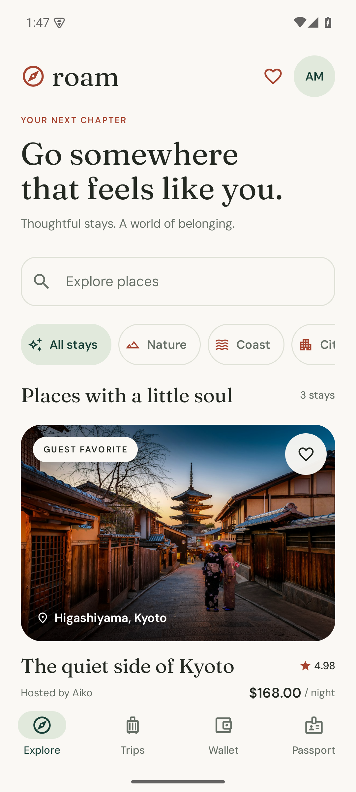
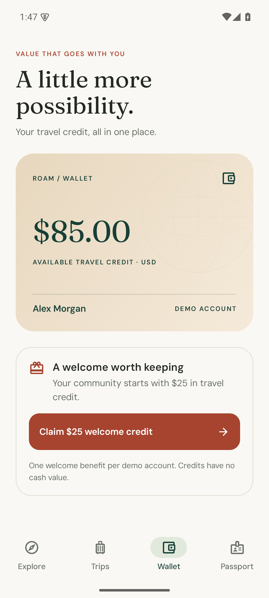
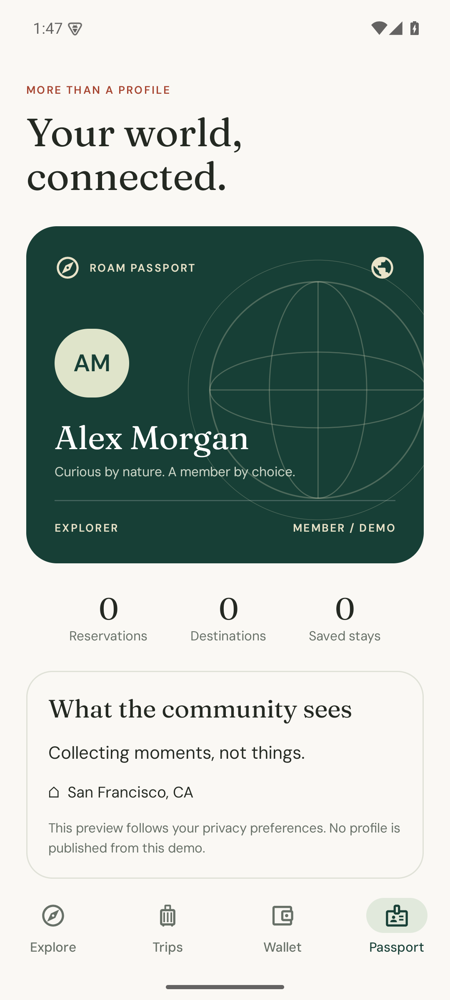

# Roam — your world, connected.

[](https://github.com/jon-jc/kotlin/actions/workflows/android.yml)


A native Android travel passport that brings identity, community value, and commerce into one considered experience. Built to demonstrate the engineering behind a dependable consumer product: exact money, atomic credits, recoverable checkout, durable state, and accessible declarative UI.

<p align="center">
  
  
  
</p>

**[Download the demo APK](https://github.com/jon-jc/kotlin/releases/latest)** · **[Architecture](docs/architecture.md)** · **[Verification](docs/verification.md)** · **[Interview walkthrough](docs/walkthrough.md)**

## The experience

* Discover stays in Japan, Italy, and Portugal; combine search, categories, and a persistent wish list.
* Plan dates and occupancy, inspect exact pricing, and apply travel credits before a simulated card payment.
* Recover a lost response without creating another booking or spending credit twice.
* Cancel before check-in, return only the credits originally used, and preserve the historical receipt.
* Claim a one-time community benefit and follow every credit movement in a durable wallet ledger.
* Edit a passport, control its public preview, and export a portable receipt through Android's share sheet.
* Use the same app in dark mode, at larger font sizes, or on a tablet with a navigation rail and adaptive grid.

No accounts, API keys, network connection, or real payment details are needed. Roam is an independent portfolio demo with fictional stays and a fictional account. Payments, inventory, and membership are simulated; no real booking or identity verification takes place.

## Run it

Use JDK 17 and an Android SDK with platform 36 and build tools 35.0.0. Import this directory into Android Studio, allow Gradle to sync, and run `app` on an Android 8.0+ device. The project includes its Gradle 8.13 wrapper; no system Gradle installation is required.

```sh
./gradlew :app:assembleDebug
adb install -r app/build/outputs/apk/debug/app-debug.apk
```

On Windows, use `gradlew.bat`. Android Studio generates `local.properties`; for command-line use, set `ANDROID_HOME` to your SDK directory. Photos and fonts are bundled, so the complete demo works offline. Initial wallet credit is $85; the one-time welcome benefit adds $25.

## Engineering decisions you can inspect

| Boundary | Implementation | Why it exists |
| --- | --- | --- |
| `core` | Pure Kotlin, policies, service, store port, receipt contract | Business invariants remain independent of Android |
| `data` | Room, SQLite WAL, unique request-key index, transaction snapshots | Balance, ledger, and receipt commit or roll back together |
| `app` | Compose, typed intents, StateFlow, SavedStateHandle, constructor injection | One observable state and recoverable checkout intent |
| `benchmark` | Macrobenchmark startup and frame timing on a minified build | Repeatable measurements with trace evidence |

Money uses checked 64-bit integer cents. Receipt JSON encodes those cents as decimal strings so web clients can preserve values beyond JavaScript's safe integer range. A request key identifies an immutable checkout payload; a conflicting retry fails instead of charging a different request. Cancellation and redemption use the same atomic boundary.

See [architecture and tradeoffs](docs/architecture.md), [receipt and service contracts](docs/contracts.md), and the [golden receipt fixture](core/src/test/resources/receipt-v1.json).

## Verify it

```sh
./gradlew spotlessCheck :core:test :data:testDebugUnitTest :app:testDebugUnitTest :app:lintDebug :app:assembleDebug
./gradlew :app:connectedDebugAndroidTest
./gradlew :benchmark:connectedBenchmarkAndroidTest
```

The first command runs 30 JVM tests, including real Room/SQLite integration tests. The second runs five native UI journeys on an attached device. The third measures five cold starts and three scroll iterations on a profileable, minified variant; use a physical device for meaningful performance comparisons. [Recorded results and limitations](docs/verification.md) distinguish automated checks, manual visual inspection, and emulator-only measurements.

Pull requests run compilation, JVM tests, lint, and API 35 emulator journeys. The performance workflow is manually dispatched because timing on shared CI hardware is noisy. Production release builds are unsigned; the installable portfolio APK uses the optimized benchmark variant signed with a local development key.

## Production boundary

The local database is authoritative only for this demonstration. A production backend must own account authorization, inventory, prices, payment intents, and fraud controls. The app collects no documents or card credentials, requests no internet permission, and excludes account data from backup and device transfer. Discovery is a bundled three-stay fixture; large datasets would require paging, remote image delivery, and server reconciliation. Copy is English-only. These limits are documented rather than presented as production capabilities.

Source is [MIT licensed](LICENSE). Photography and fonts retain their [asset licenses](docs/assets.md).
