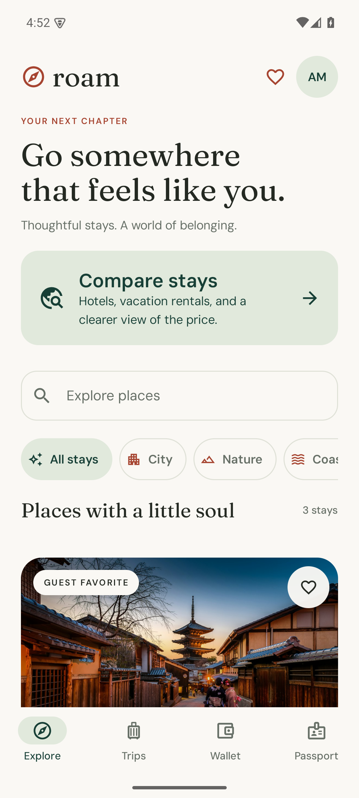
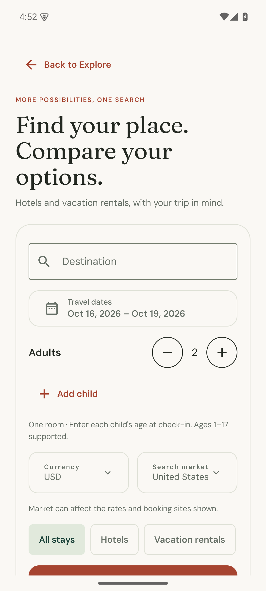

# Roam — your world, connected.

[](https://github.com/jon-jc/kotlin/actions/workflows/android.yml)


A native Android travel passport that brings identity, community value, and commerce into one considered experience. Built to demonstrate the engineering behind a dependable consumer product: exact money, atomic credits, recoverable checkout, durable state, and accessible declarative UI.

<p align="center">
  
  
  
</p>

**[Download the demo APK](https://github.com/jon-jc/kotlin/releases/latest)** · **[Architecture](docs/architecture.md)** · **[Verification](docs/verification.md)** · **[Interview walkthrough](docs/walkthrough.md)**

## The experience

* Compare hotel and vacation-rental search observations for your dates, guests and currency; inspect booking-site offers and continue on the provider's website.
* Discover stays in Japan, Italy, and Portugal; combine search, categories, and a persistent wish list.
* Plan dates and occupancy, inspect exact pricing, and apply travel credits before a simulated card payment.
* Recover a lost response without creating another booking or spending credit twice.
* Cancel before check-in, return only the credits originally used, and preserve the historical receipt.
* Claim a one-time community benefit and follow every credit movement in a durable wallet ledger.
* Edit a passport, control its public preview, and export a portable receipt through Android's share sheet.
* Use the same app in dark mode, at larger font sizes, or on a tablet with a navigation rail and adaptive grid.

The **demo** runs offline with fictional stays, an account, and simulated payments. The **connected** build uses Supabase email sign-in, a Kotlin service with PostgreSQL, and Stripe PaymentSheet. It requires your service configuration; missing configuration never falls back to simulated success. No services are deployed or merchant accounts configured by this repository.

The new **comparison** experience opens before sign-in and can run independently of account and payment services. Its SerpAPI adapter retrieves Google Hotels and vacation-rental observations; no key means no prices. Airbnb opens separately without a price claim. Start with the [API shortlist and setup guide](docs/accommodation-apis.md). Real provider acceptance remains pending your account and credentials.

## Run it

Use JDK 17 and an Android SDK with platform 36 and build tools 35.0.0. Import this directory into Android Studio, allow Gradle to sync, and run `app` on an Android 8.0+ device. The project includes its Gradle 8.13 wrapper; no system Gradle installation is required.

```sh
./gradlew :app:assembleDebug
adb install -r app/build/outputs/apk/debug/app-debug.apk
```

On Windows, use `gradlew.bat`. Android Studio generates `local.properties`; for command-line use, set `ANDROID_HOME` to your SDK directory. Photos and fonts are bundled, so the complete demo works offline. Initial wallet credit is $85; the one-time welcome benefit adds $25.

### Run the connected product

Follow [connected setup](docs/connected-setup.md) and the [service runbook](server/README.md). Copy `roam.properties.example` to the ignored `roam.properties` and supply public client configuration. Server secrets stay in the backend environment.

```sh
./gradlew :server:installDist :app:assembleStaging
adb install -r app/build/outputs/apk/staging/app-staging.apk
```

Staging installs separately from the demo. Production release builds require HTTPS endpoints and a Stripe live publishable key; they remain unsigned until your release pipeline supplies signing. New connected accounts have zero credit. Fictional inventory cannot be sold using live Stripe keys.

For search alone, run the service with `--comparison-only` and build `:app:assembleComparison` with a public HTTPS `ROAM_COMPARISON_API_URL`. This unsigned variant requires no Supabase or Stripe configuration. See [comparison setup](docs/accommodation-apis.md#configure-android).

## Engineering decisions you can inspect

| Boundary | Implementation | Why it exists |
| --- | --- | --- |
| `core` | Pure Kotlin, policies, service, store port, receipt contract | Business invariants remain independent of Android |
| `data` | Room, SQLite WAL, unique request-key index, transaction snapshots | Balance, ledger, and receipt commit or roll back together |
| `app` | Compose, typed intents, StateFlow, SavedStateHandle, constructor injection | One observable state and recoverable checkout intent |
| `network` | Cancellable HTTP, Supabase token rotation, session-scoped commerce gateway | Account isolation and reconciliation after uncertain outcomes |
| `server` | Ktor, PostgreSQL, verified JWTs, durable Stripe state machine | Authoritative prices, inventory and account authorization |
| `benchmark` | Macrobenchmark startup and frame timing on a minified build | Repeatable measurements with trace evidence |

Commerce money uses checked 64-bit integer USD cents. Receipt JSON encodes those cents as decimal strings so web clients can preserve values beyond JavaScript's safe integer range. A request key identifies an immutable checkout payload; a conflicting retry fails instead of charging a different request. Cancellation and redemption use the same atomic boundary. External comparison prices use exact decimal strings with an explicit currency and fee-coverage state; they never enter the wallet or checkout ledger.

See [architecture and tradeoffs](docs/architecture.md), [receipt and service contracts](docs/contracts.md), and the [golden receipt fixture](core/src/test/resources/receipt-v1.json).

## Verify it

```sh
docker compose -f server/compose.test.yml -p roam-integration up -d --wait
./gradlew spotlessCheck :core:test :network:test :server:test :data:testDebugUnitTest :app:testDebugUnitTest :app:lintDebug :app:lintStaging :app:assembleDebug :app:assembleStaging
./gradlew :app:connectedDebugAndroidTest
./gradlew :benchmark:connectedBenchmarkAndroidTest
```

The suites exercise real PostgreSQL and Room/SQLite, signed identity tokens, concurrent inventory allocation, interrupted payments and refunds, session erasure, and native account navigation. The benchmark measures five cold starts and three scroll iterations on a profileable, minified demo variant; use a physical device for meaningful performance comparisons. [Recorded results and limitations](docs/verification.md) distinguish automated checks from provider and device validation still required.

Pull requests run compilation, JVM tests, lint, and API 35 emulator journeys. The performance workflow is manually dispatched because timing on shared CI hardware is noisy. Production release builds are unsigned; the installable portfolio APK uses the optimized benchmark variant signed with a local development key.

## Production boundary

The connected service owns account authorization, inventory, immutable quotes, payment intents, and refund reconciliation. Android stores credentials encrypted with Android Keystore in backup-excluded storage; account screens and payment state belong to a login-scoped navigation entry. Stripe collects card details. A client payment callback triggers a server status check and cannot confirm a booking.

This is prepared for service keys and staging validation, not a claim of an operating travel marketplace. Live launch still requires authorized inventory, provider end-to-end tests, signing, support operations, taxes/payout decisions, privacy procedures, and monitored infrastructure. Discovery and history are bounded; full paging, localization, physical-device performance evidence, and a wider accessibility/device matrix remain launch work. See the [service launch requirements](server/README.md#launch-requirements).

Source is [MIT licensed](LICENSE). Photography and fonts retain their [asset licenses](docs/assets.md).
