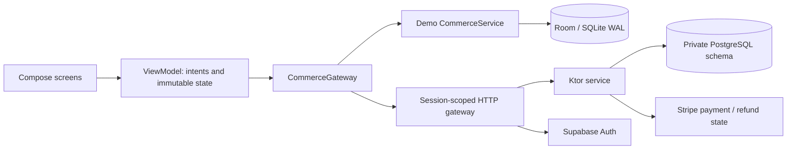

# Architecture and engineering decisions

Roam separates an offline portfolio demo from a connected travel-commerce product. Demo account, stays, credits and cards are fictional. The connected variant authenticates with Supabase and uses the Kotlin service as the authority for accounts, quotes, inventory and Stripe status. Missing configuration fails visibly; it never substitutes demo commerce.

## Boundaries

* `core`: pure Kotlin models, checked money arithmetic, demo policies, gateway/store ports, and shared wire contracts. No Android dependency.
* `data`: Room entities, transactional snapshots, indexed requests and schema migration. Local account mutations commit or roll back together.
* `network`: cancellable, bounded HTTP; Supabase token rotation; remote commerce. Concurrent refreshes serialize and credential-bearing requests never follow redirects.
* `app`: lifecycle-aware Compose, typed intents and constructor injection. Each login's navigation entry owns its ViewModels and saved checkout state. Stripe collects card details through its native SDK.
* `server`: authenticated Ktor API, private PostgreSQL schema, inventory constraints, immutable quotes, signed webhooks, provider idempotency, and leased background reconciliation.
* `benchmark`: Macrobenchmark drives a profileable, minified demo build and retains measurements and Perfetto traces.

## Account and session ownership

Connected accounts never enter the demo database. JWT verification pins issuer, audience, asymmetric algorithms, role, expiry and non-anonymous identity. Account ownership derives from the verified token, never request fields. New accounts start with zero credit; self-reported profile fields are not identity verification.

Android backup and device transfer are disabled. Credentials use Android Keystore AES-GCM with project/package-bound authenticated data and atomic storage in the backup-excluded directory. Logout removes ciphertext and its encryption key. Generation checks stop late token responses from restoring a signed-out session. A login identifier survives encrypted storage and token refresh, but changes on a fresh sign-in, including for the same user.

Navigation entries isolate account ViewModels and saved state. Signing out or switching accounts discards the prior entry without saving its state for reuse. Payment secrets and email codes stay out of saved UI state. Profiles retain their server revision through editing; background refresh is deferred or cancelled while an editor owns a draft.

## Commerce invariants

Amounts use checked 64-bit integer USD cents. Wire amounts are decimal strings so other platforms do not lose precision. Quotes preserve subtotal, service fee, total, original credit allocation and card due. Dates are civil dates, with cancellation evaluated in the property's IANA time zone.

The demo serializes balance, booking and ledger changes in one Room transaction. Connected checkout accepts a server-created five-minute quote and reserves each occupied night in `[checkIn, checkOut)` under PostgreSQL uniqueness constraints. Quotes alone do not hold inventory. A changed credit balance rejects the accepted quote instead of increasing the card charge. Per-account row locks serialize credit allocation, while night constraints prevent two accounts booking overlapping inventory.

Stripe calls occur outside database transactions, using stable keys derived from the server reservation. The reservation is durable before those calls. A lost response remains an uncertain operation that can be looked up and reconciled. The phone cannot mark a payment confirmed; even a successful SDK callback only starts a server status check. Refund completion is likewise verified before releasing inventory or credit.

The durable worker uses leases, due times and retry backoff. Stuck old requests cannot monopolize the oldest batch. Unknown provider operations older than the conservative idempotency window require review instead of blind recreation. Signed provider events can recover known IDs; unsolicited refunds raise support flags. See the [service runbook](../server/README.md) for operator recovery.

Pending payment, failed payment, pending cancellation and support review remain visible with original prices and references. Recovery uses the stored immutable request even if the stay is no longer in discovery. Demo-only receipt-v1 exports reject connected and unresolved records rather than misrepresenting real financial activity.

## Rendering, accessibility and scope

Discovery uses stable keys and an adaptive lazy grid; wide windows use a navigation rail. Images decode asynchronously at the requested size and use Coil's shared cache. Demo photos are bundled. Connected inventory accepts HTTPS image URLs; unknown resources use a neutral fallback. `ReportDrawnWhen` includes visible image settlement, including errors.

The image-loading design followed a trace finding of synchronous drawable decoding on the main thread. [Recorded v1 performance evidence](verification.md) reports both improvements and regressions without extrapolating emulator measurements to physical devices. The connected runtime requires fresh physical-device and network-condition profiling.

Native semantics label controls, progress, headings and selection; primary touch targets are at least 48dp. Dark mode and adaptive layouts are implemented. English-only copy, comprehensive TalkBack/Switch Access verification, and a wider device/version matrix remain launch work.

PostgreSQL constraints and leased work permit multiple service instances, but no production throughput is claimed. Catalog and history responses are bounded; account history currently returns the newest 200 rows. Cursor paging, indexed discovery and richer history must be added before crossing those limits. Taxes, payouts, disputes, channel-manager inventory, commercial policies and support operations depend on the actual business.

## Verification

Unit and integration suites exercise arithmetic, snapshot history, real SQLite migrations, signed tokens, real PostgreSQL contention, provider failures, HTTP cancellation and account isolation. Native tests exercise complete journeys, payment-state presentation, session navigation and Keystore storage. Provider adapters in tests are controlled substitutes, not evidence that your deployed Stripe or email configuration works. Follow the [connected setup](connected-setup.md) for those staging checks.

References: [Android architecture](https://developer.android.com/topic/architecture/recommendations), [Room transactions](https://developer.android.com/reference/androidx/room/Transaction), [Compose state](https://developer.android.com/develop/ui/compose/state), [Coil sizing](https://coil-kt.github.io/coil/compose/).
