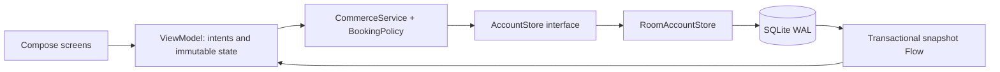

# Architecture and engineering decisions

Roam is an independent Android portfolio application for identity, community value, and travel commerce. The sample account, stays, credits, and card are fictional. A reservation simulates a payment locally. It does not reserve real inventory or charge money.

## Boundaries

* `core`: pure Kotlin models, exact-money arithmetic, validation, business operations, and persistence ports. No Android dependency.
* `data`: Room entities, indexed queries, transaction implementation, and schema history. The store serializes mutations. Failed blocks roll back all changes.
* `app`: composition root, lifecycle-aware state, Compose features, accessibility, and navigation. Constructor injection keeps dependency ownership explicit; an application-scoped container owns the database and service.

## Commerce invariants

The client creates one reservation key for each checkout attempt. A retry with that key returns the original persisted receipt. Reusing the key with different dates, guest count, stay, or credit preference fails. The database also has a unique index on the key. The lookup, latest balance read, credit allocation, booking insert, and wallet ledger append happen in one database transaction.

Every price is a signed 64-bit number of USD cents. Addition, subtraction, and multiplication detect overflow. The fixed sample service fee is 8%, rounded half up to a cent. The quote is recomputed inside the reservation transaction using the latest balance. Benefits and cancellation refunds use the same transactional boundary. Cancellation before check-in returns only the credits originally consumed and keeps the historical quote intact; retrying a cancellation cannot refund twice.

Observation reads account, bookings, and ledger in one transaction after database invalidation. Combining three independent table flows could expose a new balance with an old receipt; this implementation deliberately avoids that inconsistency.

## Scope and scaling

The local store is the authority only for this demo. It demonstrates transaction boundaries, retry semantics, and persistence without external credentials. In a deployed system, a backend must be the authority for prices, availability, authorization, payment intent state, and fraud controls. Client-side balance checks are never an authorization mechanism. The API contract specifies that replacement boundary.

The catalog is a small bundled fixture. Real discovery needs server pagination, an indexed cache, image delivery, and cancellation-aware requests. Booking and ledger tables are indexed but the demo observes full lists; a large account would use Paging 3 and a separate aggregate balance query. These are explicit limits, not claims of measured production scale.

No identity documents, card numbers, access tokens, or telemetry leave the device. Android backup is disabled. The app requests no network permission. Local profile fields are user-editable demonstration data, not identity verification.

## Verification approach

Pure Kotlin tests cover date and occupancy boundaries, currency arithmetic, fee allocation, and input validation. Robolectric tests use real Room/SQLite transactions for races, unique-key conflicts, rollbacks, one-time redemption, cancellation, persistence, and process-style database reopening.

The ViewModel exposes one immutable state stream, accepts typed intents, and collects the transactional database stream. A `SavedStateHandle` retains checkout details and the exact request key across Android process recreation. Transient operations serialize at the UI boundary and again in the database; cancellation is propagated. After an interrupted response, checkout displays the persisted original quote and retries the same request key.

Seven ViewModel tests cover duplicate taps, decline isolation, lost-response recovery, restored checkout, frozen in-flight input, profile validation, and composed discovery filters. Four native Compose tests exercise complete user journeys against isolated Room databases on API 35. They assert eventual observable state after asynchronous persistence, not timing assumptions.

The layout uses a navigation rail on wide windows and an adaptive discovery grid. Dark colors follow the system. Interactive icons have meaningful accessibility labels; headings, selectable controls, and form fields expose native semantics. Primary controls are at least 48dp. The sample copy is English-only; a production localization pass would extract it to resources and include pseudolocale/RTL testing.

References: [Android architecture recommendations](https://developer.android.com/topic/architecture/recommendations), [Room transactions](https://developer.android.com/reference/androidx/room/Transaction), [Compose state](https://developer.android.com/develop/ui/compose/state).
