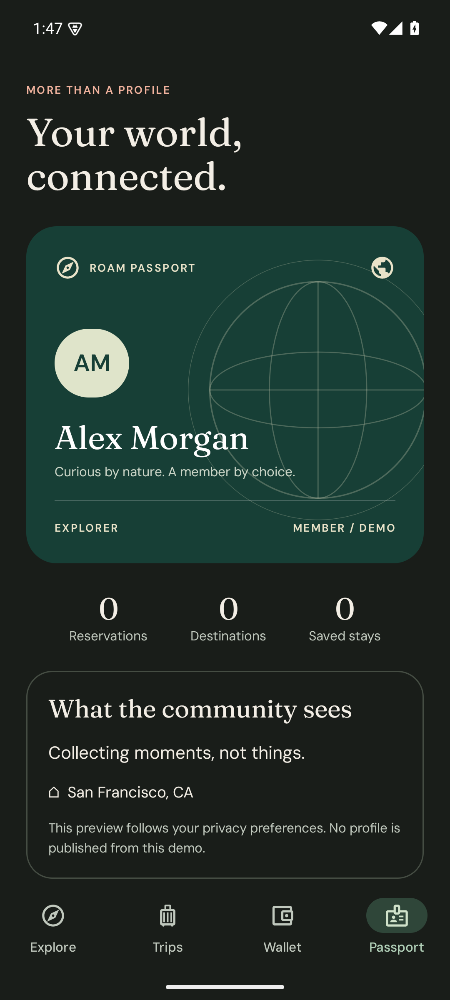
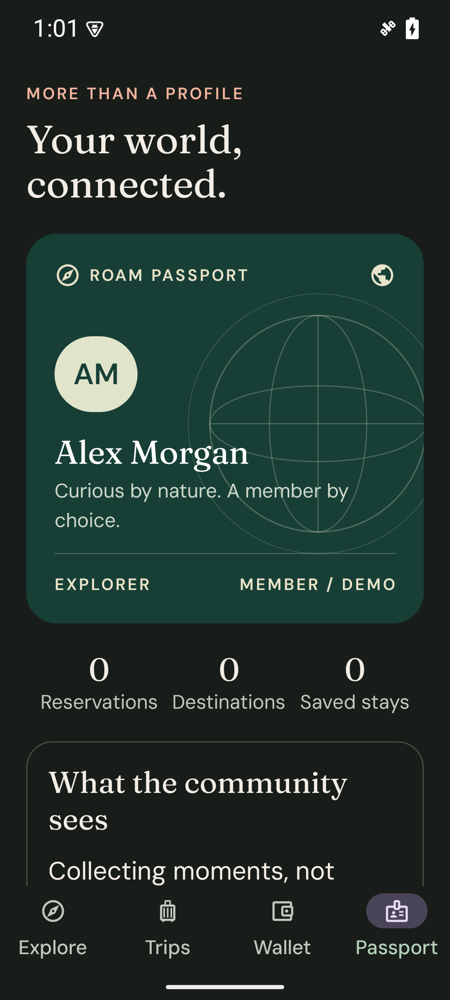
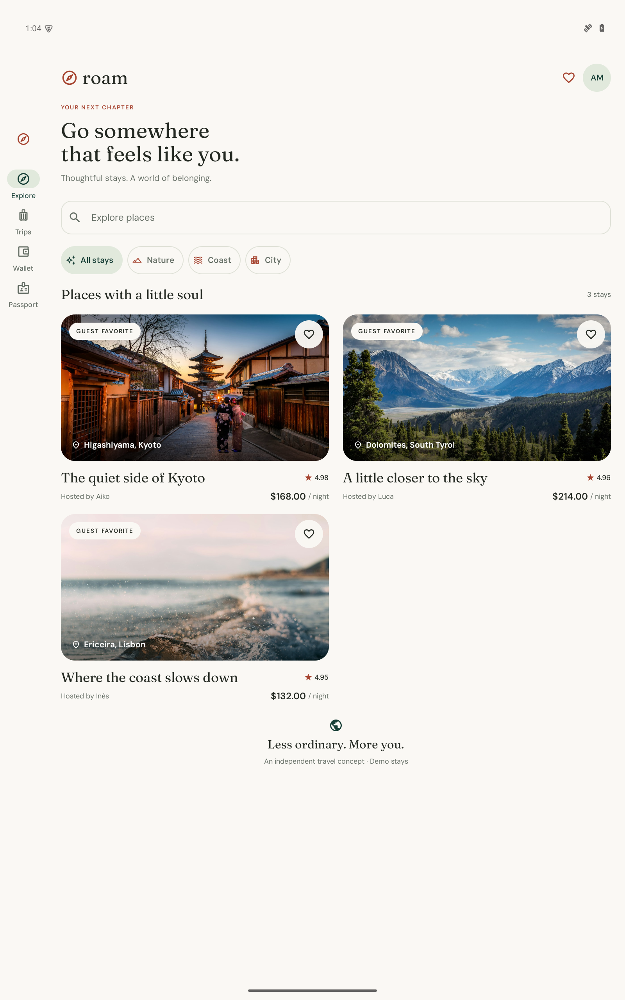

# Verification evidence

This report preserves the **v1.0.0 offline release** evidence below. Its original counts and measurements do not describe the expanded connected build. Current checks are defined in the Android and commerce-service workflows; connected setup and provider validation are described in [the setup guide](connected-setup.md). No production traffic or live merchant validation is claimed.

## Automated correctness

| Suite | Tests | Boundary exercised |
| --- | ---: | --- |
| BookingPolicyTest | 6 | Exact credit allocation; date/occupancy boundaries; leap day; 28-night limit; overflow; profile validation |
| CommerceIntegrationTest | 10 | Real Room/SQLite transactions; 24 concurrent retries; conflicting keys; overdraft prevention; rollback; duplicate benefit claims; cancellation window; persistent reopen |
| RoamViewModelTest | 7 | Duplicate taps; decline; committed-but-lost response; saved checkout restoration; in-flight edits; validation; combined filters |
| ReceiptContractTest | 7 | Golden fixture; private-field exclusion; cancellation; additive evolution; incompatible protocol; malformed money; values above JavaScript's safe integer range |
| JourneyTest | 5 | Native discovery, wallet/profile, decline/retry, lost-response recovery/cancellation, and actual receipt URI export |

All 30 JVM tests and five native UI tests pass locally. Native tests use isolated in-memory Room databases on API 35 and check eventual UI state after persistence. The receipt journey intercepts Android's share chooser, verifies a narrow read-only content grant, opens the exported JSON, and checks the privacy boundary without sending anything.

The JSON Schema validator separately accepts the golden and additive fixtures and rejects five incompatible structures. Kotlin tests enforce arithmetic and temporal invariants beyond JSON Schema. Android lint reports zero errors. Spotless checks Kotlin source and Gradle scripts. CI also builds the optimized app and benchmark APKs so performance tooling cannot silently stop compiling.

Reproduce correctness checks:

```sh
python -m pip install jsonschema==4.25.1
python tools/check_contract.py
./gradlew spotlessCheck :core:test :data:testDebugUnitTest :app:testDebugUnitTest :app:lintDebug :app:assembleDebug :app:assembleBenchmark :benchmark:assembleBenchmark
./gradlew :app:connectedDebugAndroidTest
```

## Device and visual inspection

The app was inspected on an API 35 Pixel-style emulator at 1080 × 2400, in light and dark mode, at 150% font size, and with a 1600 × 2560 tablet window. Native semantics, labelled icon actions, and 48dp controls support accessibility. These checks do not substitute for TalkBack/Switch Access testing or a physical-device and Android-version matrix.

<p>
  
  
  
</p>

## Performance method

`RoamBenchmark` runs against an R8-minified, resource-shrunk, non-debuggable and profileable app. It measures five cold starts and three scroll iterations. Both use `CompilationMode.None()`; no app-specific baseline profile has been generated. Startup's fully drawn marker includes data and visible photos. Scrolling traverses the discovery feed down and back up, including lazy composition and image loading.

Recorded runs use API 35 x86_64, Windows hardware virtualization, software graphics, four virtual CPU cores, 1080 × 2400 resolution, and normal animation speed. The benchmark's emulator warning was explicitly suppressed to inspect traces. Host load, software graphics, and unlocked clocks make these diagnostic comparisons, not physical-device guarantees or release gates. Raw JSON records the actual device context and individual samples.

Run on a physical device:

```sh
./gradlew :benchmark:connectedBenchmarkAndroidTest
```

To reproduce on an emulator, add `-Pandroid.testInstrumentationRunnerArguments.androidx.benchmark.suppressErrors=EMULATOR`. The manually dispatched performance workflow uses this diagnostic mode and retains JSON and Perfetto artifacts. Open traces with [Perfetto](https://ui.perfetto.dev/).

## Trace-led improvement

The original `painterResource` path synchronously decoded a 1200 × 1797 photo on the main thread for 21.9 ms during scrolling. `ImageDecoder#decodeDrawable` occupied 22.4 ms inside lazy-item composition. The replacement uses constraint-aware asynchronous Coil decoding and a shared memory cache. It also waits for image completion before reporting fully drawn, so an empty placeholder does not artificially improve startup results.

| Measurement (ms) | Before | After |
| --- | ---: | ---: |
| Cold initial display, median | 486.5 | 515.0 |
| Cold fully drawn, median | 857.7 | 858.6 |
| Scroll CPU frame duration, P50 | 11.2 | 18.0 |
| Scroll CPU frame duration, P95 | 31.1 | 33.2 |
| Scroll deadline overrun, P99 | 38.7 | 26.0 |

Raw results: [before](performance/emulator-api35-before.json) and [after](performance/emulator-api35-after.json). Both benchmark methods completed successfully. These are two diagnostic runs, not a statistically established speedup: median frame time regressed, fully drawn startup was nearly unchanged, and the worst-tail overrun improved. Do not extrapolate these emulator timings to physical devices.

The second scroll trace shows a narrower, attributable improvement: maximum main-thread lazy composition was 23.53 ms before; the longest main-thread work slice afterward was 11.68 ms, and maximum recomposition was 3.36 ms instead of 23.11 ms. These are trace slices, not overall frame-time percentiles. The after trace still spends significant time in RenderThread drawing and buffer swaps. Asynchronous decoding resolves the identified UI-thread work; physical-device profiling remains necessary to evaluate overall rendering and memory tradeoffs.

The release's trace archive contains the eight traces from each run. The before run used the same benchmark harness before the image-loading change. To reproduce the main-thread investigation, run [main-thread.sql](performance/main-thread.sql) in Perfetto's SQL query view. Compare scroll iteration 001 from each run; all samples remain available rather than selecting only favorable iterations.

## Release boundaries

The installable portfolio APK is the optimized benchmark variant, signed with a local development key. The production release variant remains unsigned; production signing credentials are never committed. Release evidence includes source, the installable APK, and benchmark traces. The demo has no network permission and makes no real reservations, charges, or identity-verification claims.

Before a production launch: implement authoritative backend contracts and authentication, provider-level payment idempotency and reconciliation, paging, localization, a broader device/accessibility matrix, privacy/security review, physical-device profiling, a generated baseline profile, and a monitored staged rollout.
